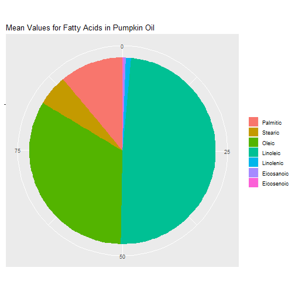

## Intro

<b> Fats and Oils</b> 
<i>Basic Structure: Triglycerides</i>
<ul>
<li>3 fatty acid units joined to glycerol, a trihydroxy alcohol</li>
<li>Colorless, odorless and tasteless in pure form</li>
<ul>
<li>Characteristics come from foreign substances absorbed by them</li>
</ul></ul>

--- .class healthEffects
## Fats and Oils:

<h3>Positive Effects</h3>

> 1. Provide energy
> 2. Insulate body organs
> 3. Transport fat-soluble vitamins throughout the body
> 4. Favorably influence the metabolism of diabetics

<h3>Negative Effects</h3>

> 1. Lead to increased serum cholesterol levels
> 2. High levels can lead to increased risk of coronary heart disease

--- .class #info
## Demo Information

For this demo, I used the <b>oil</b> dataset provided with the <b>caret</b>
library. The dataset tracks the types of fatty acids in commercially available 
oils.

For my interactive demo, I used plotly to allow the user to select different
values for the fatty acids, then found the oil that most closely matched their 'mix'. But I cannot get plotly to work correctly here. Therefore, this demo will show a heatmap of the data that visualizes the fatty acids in each type of oil.

--- .class #demo
## Types of Fats

---
## References

Leward Community College. <i>17.2: Fats and Oils</i>. <b>Chemistry Libre Texts</b>. Retrieved 14 May 2019 from https://chem.libretexts.org/Bookshelves/Introductory_Chemistry/Book%3A_The_Basics_of_GOB_Chemistry_(Ball_et_al.)/17%3A_Lipids/17.2%3A_Fats_and_Oils.

RDocumentation. <b>oil</b>. Retrieved 12 May 2019 from https://www.rdocumentation.org/packages/caret/versions/6.0-81/topics/oil.

Wahrburg, U. <i>What are the health effects of fat?</i> <b>Eur J Nutr</b> (2004) 43(Suppl 1): i6. https://doi.org/10.1007/s00394-004-1103-9

